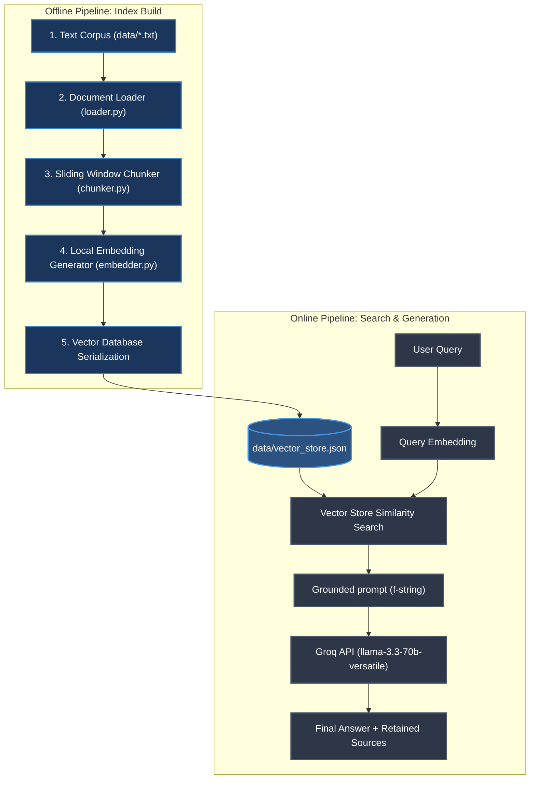

# RAG from Scratch (No LangChain)

A modular, lightweight, and fully customized **Retrieval-Augmented Generation (RAG)** pipeline built completely from scratch using standard Python libraries, NumPy, and the raw OpenAI SDK. 

This project is built for **educational purposes** to strip away the "black box" abstraction of high-level frameworks (like LangChain, LlamaIndex, or Haystack) and expose the underlying mechanics of text loading, chunking strategies, embedding generation, vector similarity math, and prompt grounding.

---

## Key Architectural Highlights

*   **No LangChain/LlamaIndex**: Every line of code is written in pure Python.
*   **Fully Local Embeddings**: Text chunk vectors are generated completely offline using the `sentence-transformers` library (`all-MiniLM-L6-v2` model yielding 384-dimensional vectors). No external API or local server (like Ollama) is required for embedding generation.
*   **Groq LLM Acceleration**: Answer generation runs at ultra-high speed by leveraging the OpenAI SDK pointed at the Groq API Base URL, utilizing the state-of-the-art open-weights `llama-3.3-70b-versatile` model.
*   **NumPy Cosine Similarity**: Search ranking is computed manually using linear algebra matrix dot products and Euclidean norms in raw `numpy`.
*   **Modular Design**: Each stage exists in its own module with clean boundaries and full `pytest` verification (20+ tests passing successfully).

---

## System Workflow



---

## Detailed Pipeline Stages

### 1. Document Loader (`src/loader.py`)
*   **Role**: Discovers and loads plain text files.
*   **Features**:
    *   Walks the `data/` directory dynamically using standard library operations (`os.listdir`, `pathlib`).
    *   Implements robust UTF-8 parsing with a fallback encoding scheme (`latin-1`/`cp1252`) to prevent runtime crashes when parsing diverse files.
    *   Aggregates documents into structured dictionaries containing content, filename, filepath, word counts, and character counts.

### 2. Text Chunker (`src/chunker.py`)
*   **Role**: Segments loaded documents into smaller overlapping text segments.
*   **Strategies**:
    *   **Fixed Character Chunker (`chunk_fixed`)**: Uses character count thresholds and sliding window indexing to generate chunks with configurable overlap, ensuring contextual continuity.
    *   **Sentence-Boundary Chunker (`chunk_by_sentence`)**: Splits text at logical ends of sentences (`.`, `?`, `!`) and groups them up to a size limit.
    *   Filters out zero-length or purely whitespace-filled chunks automatically.

### 3. Local Embeddings (`src/embedder.py`)
*   **Role**: Converts text strings into dense vector representations.
*   **Model**: `all-MiniLM-L6-v2` via `sentence-transformers` (runs entirely locally, offline, and does not require API keys or local server overhead).
*   **Takeaway**: The same model is utilized to embed both document chunks (offline phase) and user queries (online phase).

### 4. In-Memory Vector Store (`src/vector_store.py`)
*   **Role**: Performs fast database storage, search execution, and disk persistence.
*   **Cosine Similarity Math**:
    Calculated manually using `numpy` based on the formula:
    $$\text{Similarity}(Q, D) = \frac{Q \cdot D}{\|Q\| \|D\|} = \frac{\sum_{i=1}^{n} Q_i D_i}{\sqrt{\sum_{i=1}^{n} Q_i^2} \sqrt{\sum_{i=1}^{n} D_i^2}}$$
    An epsilon of `1e-9` is added to denominators to prevent division by zero errors.
*   **Persistence**: Supports serializing the in-memory coordinate list and matching chunks directly to and from a single JSON database file (`data/vector_store.json`).

### 5. Query Retriever (`src/retriever.py`)
*   **Role**: Coordinates query vector conversion and vector store search execution.
*   **Features**: Returns a list of the top-K matches with score values and source filenames. Handles empty vector stores gracefully without crashing.

### 6. LLM Generator (`src/generator.py`)
*   **Role**: Calls the LLM to write a grounded answer.
*   **Configuration**: Points the standard `OpenAI` client SDK to Groq's Base URL (`https://api.groq.com/openai/v1`) using `llama-3.3-70b-versatile`.
*   **Grounding Guardrail**: Injects strict grounding constraints via system prompts, forcing the model to only use the context provided. If no chunks are retrieved or if the answer is missing, it returns the standard message: *"I don't know based on the provided context."*

---

## Directory Structure

```
.
├── data/                                # Text corpus (Wikipedia articles)
│   ├── artificial_intelligence.txt
│   ├── deep_learning.txt
│   ├── history_of_ai.txt
│   ├── machine_learning.txt
│   ├── natural_language_processing.txt
│   └── vector_store.json                # Serialized database (generated)
├── src/
│   ├── __init__.py
│   ├── loader.py                        # Loader module
│   ├── chunker.py                       # Text chunker module
│   ├── embedder.py                      # Local embedding generator
│   ├── vector_store.py                  # Cosine similarity database
│   ├── retriever.py                     # Retrieval coordinator
│   ├── generator.py                     # Groq LLM responder
│   └── pipeline.py                      # Pipeline coordinator
├── tests/
│   ├── __init__.py
│   ├── test_loader.py
│   ├── test_chunker.py
│   ├── test_embedder.py
│   ├── test_vector_store.py
│   ├── test_retriever.py
│   └── test_generator.py
├── .env                                 # Environment keys (ignored by git)
├── .env.example                         # Environment keys template
├── .gitignore                           # Git ignore config
├── AGENTS (3).md                        # Agent role definitions
├── LEARNINGS.md                         # Mathematical breakdowns
├── main.py                              # CLI interface entry point
├── PRD.md                               # Project requirements document
└── requirements.txt                     # Dependencies list
```

---

## Installation & Setup

1.  **Clone the Repository**:
    ```bash
    git clone https://github.com/JalpPansuriya/RAG_Without_LangChain.git
    cd RAG_Without_LangChain
    ```

2.  **Install Dependencies**:
    ```bash
    pip install -r requirements.txt
    ```

3.  **Set Up Environment Keys**:
    Copy the example configuration to your active `.env` file:
    ```bash
    cp .env.example .env
    ```
    Open `.env` and fill in your active Groq API Key (get one from the [Groq Console](https://console.groq.com/)):
    ```env
    GROQ_API_KEY=gsk_your_actual_key_here
    ```

---

## How to Run the Pipeline

The program exposes three main operations via the command line interface:

### 1. Build the Search Index (Offline Phase)
Ingest documents, chunk them, embed them locally, and save the database to disk:
```bash
python main.py --build-index
```
*This generates a file at `data/vector_store.json` containing the chunk coordinates and mapping metadata.*

### 2. Run a Single Question (Online Phase)
Query the pipeline for a specific answer:
```bash
python main.py --query "What is the Turing test?"
```
*The program outputs a clean, readable ASCII box containing the Question, Grounded Answer, and Retained Sources with similarity scores.*

### 3. Run in Interactive Mode
Start a continuous REPL session to ask multiple questions in sequence:
```bash
python main.py --interactive
```
*Type `exit` or `quit` to exit interactive mode.*

---

## Running Unit Tests

Unit tests mock out all external LLM network APIs, running entirely offline and quickly.

Run the test suite with:
```bash
python -m pytest
```

To run with verbose output:
```bash
python -m pytest -v
```

---

## Banned Libraries & Strict Constraints

To maintain the learning intent of this project, the following conventions are strictly enforced:

*   **Banned Frameworks**: `langchain`, `llama_index`, `haystack`
*   **Banned Vector Stores**: `chromadb`, `faiss`, `pinecone`, `weaviate`
*   **Banned Math Abstractions**: `scikit-learn` (for similarity), `scipy` (for distance)
*   **Pure Functions**: Functions pass state explicitly through parameters (no global variables).
*   **Explicit Math**: All math formulas (norms, dot products) are written out manually in NumPy and annotated in-line.
